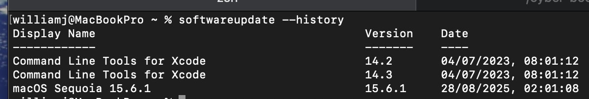

# Day 01 – Security Controls Lab


## 🔹 Patching
```bash
softwareupdate --history

```
Display Name                                       Version    Date                  
------------                                       -------    ----                  
Command Line Tools for Xcode                       14.2       04/07/2023, 08:01:12  
Command Line Tools for Xcode                       14.3       04/07/2023, 08:01:12  
macOS Sequoia 15.6.1                               15.6.1     28/08/2025, 02:01:08  


📸 Screenshot: 


✅ Notes:
System is running the latest version macOS Sequoia 15.6.1 (installed 28 Aug 2025).
Command Line Tools for Xcode were also updated in 2023.
This confirms the system is patched, reducing exposure to known vulnerabilities.


## 🔹 Users & Least Privilege
```bash
dscl . -read /Groups/admin GroupMembership

```
GroupMembership: root williamj

✅ Notes:
Only williamj (my main user) and root have admin rights.
No unexpected accounts found.
This enforces the least privilege principle, limiting the risk of privilege escalation.


## 🔹 Authentication & Encryption
```bash
sudo fdesetup status

```
FileVault is On.

✅ Notes:
Was disabled at first, enabled it and added my recovery key on secure drive
FileVault is enabled now, which means the entire disk is encrypted.
This ensures data remains protected if the Mac is lost or stolen.

```bash
pwpolicy getaccountpolicies

```
policyAttributePassword matches '.{4,}+'
Minimum password length = 4 characters

✅ Notes:
Current policy enforces only a 4-character minimum password, which is weak by modern standards.
For stronger security, I would set at least 8–12 characters with complexity.
This exercise highlights how authentication policies can be checked and hardened.